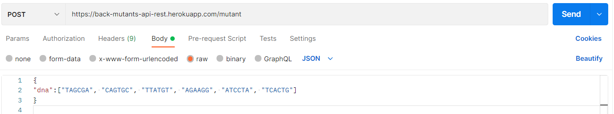
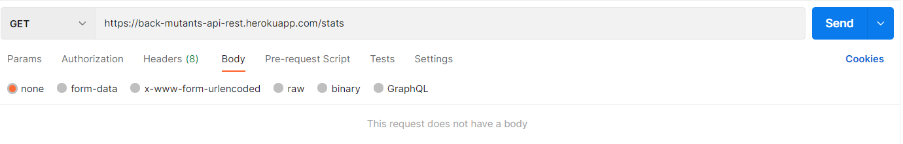
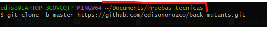
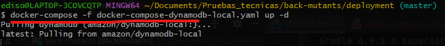
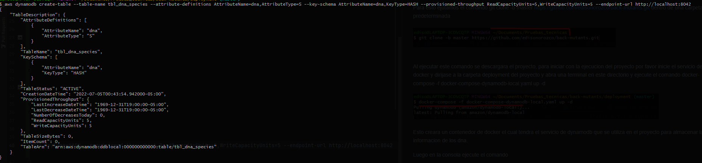
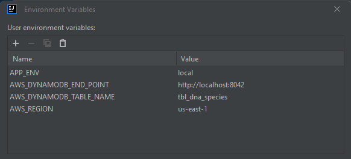
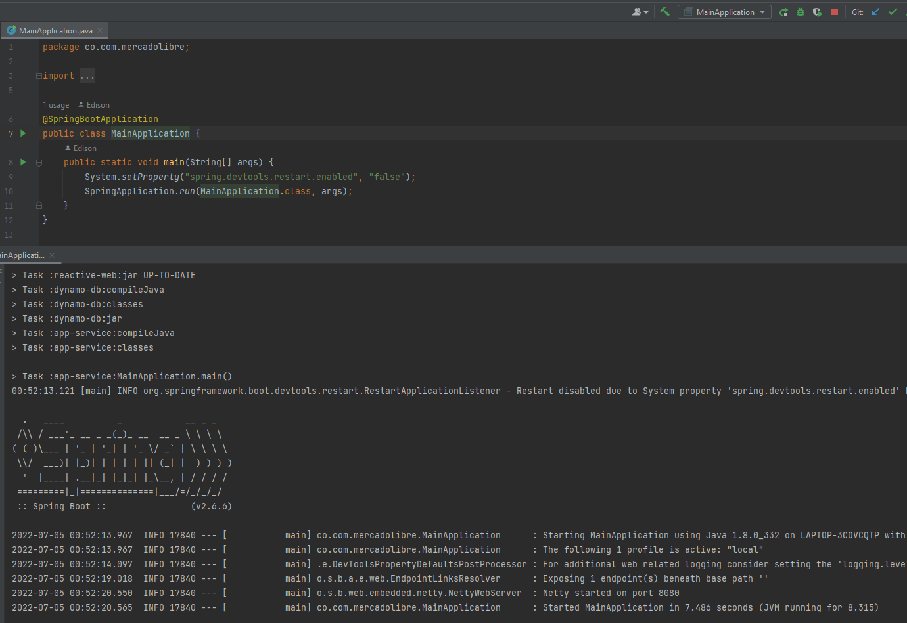
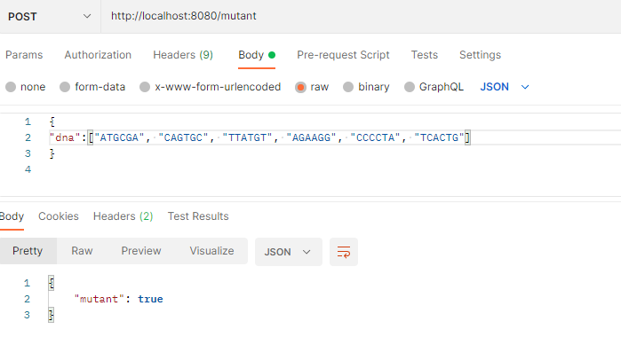

# Ejecucion del proyecto

Para consumir de forma remota puede hacer uso de un aplicativo como postman para realizar pticiones,
a continuacion se listan los end point:

validar dna https://back-mutants-api-rest.herokuapp.com/mutant

obtener estadisticas https://back-mutants-api-rest.herokuapp.com/stats

### Si  desea implementar el proyecto de forma local en su ordenador siga los siquientes pasos:

#### Pre-requisitos

- Gradle 6.9.1 o superior
- Intellij Idea Community Edition
- Docker
- AWS CLI
- Git

#### 1. Clonar el repositorio

Para esto ejutamos el comando git clone -b master https://github.com/edisonorozco/back-mutants.git dentro de una carpeta
predeterminada

#### 2. Crear imagen docker de dynamodb

Al ejecutar este comando se descargara el proyecto, para iniciar con la ejecucion del proyecto por favor inicie
el servicio de docker y dirijase a la carpeta deployment del proyecto y abra una terminal en este directorio y ejecute
el comando docker-compose -f docker-compose-dynamodb-local.yaml up -d

Esto creara un contenedor de docker el cual tendra el servicio de dynamodb que se utiliza en el proyecto
para almacenar la informacion de los dna.

Luego en la consola ejecute el comando 

aws dynamodb create-table --table-name tbl_dna_species --attribute-definitions AttributeName=dna,AttributeType=S --key-schema AttributeName=dna,KeyType=HASH --provisioned-throughput ReadCapacityUnits=5,WriteCapacityUnits=5 --endpoint-url http://localhost:8042

Este comando crea una tabla en donde almacenaremos nuestros datos

#### 3. Ejecutar proyecto en intellij

Importe el proyecto en el IDE intellij Idea. Configure las siguientes variables de entorno en intellij

APP_ENV=local;

AWS_DYNAMODB_END_POINT=http://localhost:8042;

AWS_DYNAMODB_TABLE_NAME=tbl_dna_species;

AWS_REGION=us-east-1

Guarde la configuracion y ejecute el proyecto

Realice pruebas con postman

# Proyecto Base Implementando Clean Architecture

## Antes de Iniciar

Empezaremos por explicar los diferentes componentes del proyectos y partiremos de los componentes externos, continuando con los componentes core de negocio (dominio) y por �ltimo el inicio y configuraci�n de la aplicaci�n.

Lee el art�culo [Clean Architecture � Aislando los detalles](https://medium.com/bancolombia-tech/clean-architecture-aislando-los-detalles-4f9530f35d7a)

# Arquitectura

## Domain

Es el m�dulo m�s interno de la arquitectura, pertenece a la capa del dominio y encapsula la l�gica y reglas del negocio mediante modelos y entidades del dominio.

## Usecases

Este m�dulo gradle perteneciente a la capa del dominio, implementa los casos de uso del sistema, define l�gica de aplicaci�n y reacciona a las invocaciones desde el m�dulo de entry points, orquestando los flujos hacia el m�dulo de entities.

## Infrastructure

### Helpers

En el apartado de helpers tendremos utilidades generales para los Driven Adapters y Entry Points.

Estas utilidades no est�n arraigadas a objetos concretos, se realiza el uso de generics para modelar comportamientos
gen�ricos de los diferentes objetos de persistencia que puedan existir, este tipo de implementaciones se realizan
basadas en el patr�n de dise�o [Unit of Work y Repository](https://medium.com/@krzychukosobudzki/repository-design-pattern-bc490b256006)

Estas clases no puede existir solas y debe heredarse su compartimiento en los **Driven Adapters**

### Driven Adapters

Los driven adapter representan implementaciones externas a nuestro sistema, como lo son conexiones a servicios rest,
soap, bases de datos, lectura de archivos planos, y en concreto cualquier origen y fuente de datos con la que debamos
interactuar.

### Entry Points

Los entry points representan los puntos de entrada de la aplicaci�n o el inicio de los flujos de negocio.

## Application

Este m�dulo es el m�s externo de la arquitectura, es el encargado de ensamblar los distintos m�dulos, resolver las dependencias y crear los beans de los casos de use (UseCases) de forma autom�tica, inyectando en �stos instancias concretas de las dependencias declaradas. Adem�s inicia la aplicaci�n (es el �nico m�dulo del proyecto donde encontraremos la funci�n �public static void main(String[] args)�.

**Los beans de los casos de uso se disponibilizan automaticamente gracias a un '@ComponentScan' ubicado en esta capa.**

## Prerequisitos

