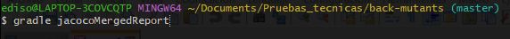
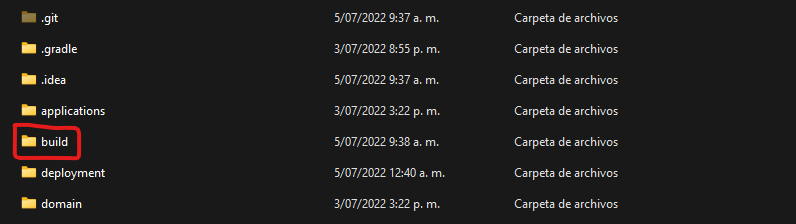
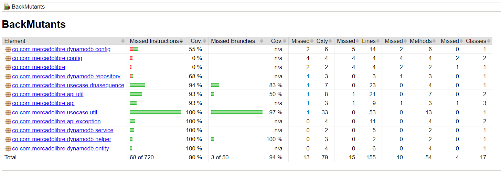

# Ejecucion del proyecto

A continuacion se listan los endpoints del aplicativo, asi como dos imagenes con un ejemplo de como se realizan las peticiones 
https con Postman.

validar dna https://back-mutants-api-rest.herokuapp.com/mutant

obtener estadisticas https://back-mutants-api-rest.herokuapp.com/stats

### Si  desea implementar el proyecto de forma local en su ordenador siga los siquientes pasos:

### Pre-requisitos

- Gradle 6.9.1 o superior
- Intellij Idea Community Edition
- Docker
- AWS CLI
- Git

### 1. Clonar el repositorio

Para esto ejutamos el comando git clone -b master https://github.com/edisonorozco/back-mutants.git dentro de una carpeta
predeterminada

### 2. Crear imagen docker de dynamodb

Al ejecutar el comando anteriror se descargara el proyecto en nuestro ordenador, para iniciar con la ejecucion del proyecto por favor inicie
el servicio de docker y dirijase a la carpeta deployment del proyecto y abra una terminal en este directorio y ejecute
el comando  <b> docker-compose -f docker-compose-dynamodb-local.yaml up -d </b>

Esto creara un contenedor de docker el cual tendra el servicio de dynamodb que se utiliza en el proyecto
para almacenar la informacion de los dna.

Luego en la consola ejecute el comando 

<b>aws dynamodb create-table --table-name tbl_dna_species --attribute-definitions AttributeName=dna,AttributeType=S --key-schema AttributeName=dna,KeyType=HASH --provisioned-throughput ReadCapacityUnits=5,WriteCapacityUnits=5 --endpoint-url http://localhost:8042</b>

Este comando crea una tabla en donde almacenaremos nuestros datos, hago enfasis que esta parte es para hacer test
locales con dynamodb, ya que para el despliegue del proyecto en nube se utilizo una dynamodb real en una cuenta de AWS

### 3. Ejecutar proyecto en intellij

Importe el proyecto en el IDE intellij Idea. Configure las siguientes variables de entorno en intellij

APP_ENV=local;

AWS_DYNAMODB_END_POINT=http://localhost:8042;

AWS_DYNAMODB_TABLE_NAME=tbl_dna_species;

AWS_REGION=us-east-1

Guarde la configuracion y ejecute el proyecto

Realice pruebas con postman

# Documentacion proyecto

En esta seccion se describen las tecgonogias, servicios y demas elementos utilizados en el desarrollo del Api Rest

## Proyecto Base Implementando Clean Architecture

Para la arquitectura se opto por utilizar Clean Architecture ya que provee un desacople y facil escalamiento de los componentes.

Empezaremos por explicar los diferentes componentes del proyectos y partiremos de los componentes externos, continuando con los componentes core de negocio (dominio) y por ultimo el inicio y configuracion de la aplicacion.

Lee el articulo [Clean Architecture � Aislando los detalles](https://medium.com/bancolombia-tech/clean-architecture-aislando-los-detalles-4f9530f35d7a)

# Arquitectura

### Domain

Es el modulo mas interno de la arquitectura, pertenece a la capa del dominio y encapsula la logica y reglas del negocio mediante modelos y entidades del dominio.

### Usecases

Este modulo gradle perteneciente a la capa del dominio, implementa los casos de uso del sistema, define logica de aplicacion y reacciona a las invocaciones desde el m�dulo de entry points, orquestando los flujos hacia el modulo de entities.

## Infrastructure

### Helpers

En el apartado de helpers tendremos utilidades generales para los Driven Adapters y Entry Points.

Estas utilidades no estan arraigadas a objetos concretos, se realiza el uso de generics para modelar comportamientos
genericos de los diferentes objetos de persistencia que puedan existir, este tipo de implementaciones se realizan
basadas en el patron de diseno [Unit of Work y Repository](https://medium.com/@krzychukosobudzki/repository-design-pattern-bc490b256006)

Estas clases no puede existir solas y debe heredarse su compartimiento en los **Driven Adapters**

### Driven Adapters

Los driven adapter representan implementaciones externas a nuestro sistema, como lo son conexiones a servicios rest,
soap, bases de datos, lectura de archivos planos, y en concreto cualquier origen y fuente de datos con la que debamos
interactuar.

### Entry Points

Los entry points representan los puntos de entrada de la aplicacion o el inicio de los flujos de negocio.

### Application

Este modulo es el mas externo de la arquitectura, es el encargado de ensamblar los distintos modulos, resolver las dependencias y crear los beans de los casos de use (UseCases) de forma automatica, inyectando en estos instancias concretas de las dependencias declaradas. Ademas inicia la aplicacion (es el unico modulo del proyecto donde encontraremos la funcion public static void main(String[] args).

**Los beans de los casos de uso se disponibilizan automaticamente gracias a un '@ComponentScan' ubicado en esta capa.**

# Base de datos

Para almacenar la informacion de los dna se opto por utilizar una base de datos NoSql en este cado dynamodb, para esto
se consulta la documentacion oficial de aws acerca de dynamodb.

https://aws.amazon.com/es/dynamodb/?trk=74365dcd-ec2d-40b2-a201-8d654d09350d&sc_channel=ps&sc_campaign=acquisition&sc_medium=ACQ-P|PS-GO|Brand|Desktop|SU|Database|DynamoDB|LATAMO|ES|Text&s_kwcid=AL!4422!3!590500029985!e!!g!!aws%20dynamodb&ef_id=CjwKCAjwwo-WBhAMEiwAV4dybQU1NRv7dBKfzBUhPe0Y0QCymLcRFRqkl26epbtZAkyiWPXWskoOVxoCrgYQAvD_BwE:G:s&s_kwcid=AL!4422!3!590500029985!e!!g!!aws%20dynamodb

# Coverage

El proyecto utiliza la librearia de jacoco con la cual se configura una tarea con gradle para mostrar la cobertura
de las pruebas, para ver estas estadisticas abra una consola en el directorio raiz de la aplicacion y ejecute el 
comando  gradle jacocoMergedReport 

Este comando generara una carpeta llamada build dentro de la estructura del proyecto

Ingrese a esta carpeta y navegue dentro del directorio hasta hallar la carpeta html, alli dentro
del directorio html hallara un archivo index.html ejecutelo con el navegador y podra ver algo como esto

# Despliegue de la app en nube

Para desplegar la aplicacion en nube se opto por utilizar el servicio de Heroku, el cual provee
una capa gratuita para exponer servicios hacia intenet.
